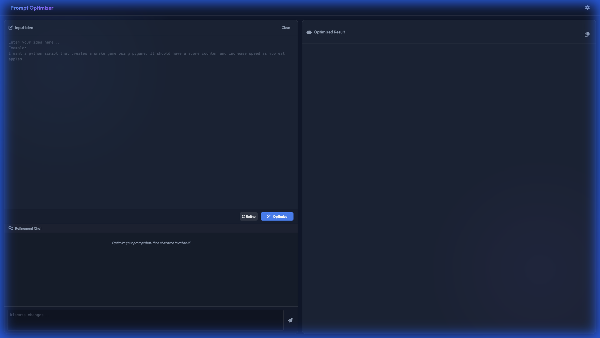

# Prompt Optimizer

A premium, frontend-only web application designed to help you craft, refine, and version-control your LLM prompts using a **local AI server**.

## Features

- **Local & Private**: Runs entirely in your browser and connects to your local LLM (LM Studio, Ollama, etc.). No API keys required.
- **Smart Optimization**: Turns freeform ideas into structured, professional prompts (YAML + Markdown).
- **Chat & Refine**: Discuss changes with the AI and incrementally refine your prompt using the built-in chat interface.
- **Result History**: Navigate through previous versions of your optimized prompt to compare results.
- **Premium UI**: Features a modern glassmorphic design with dark mode and smooth animations.

## Prerequisites

You need a local LLM server running that is compatible with the OpenAI API format.

- **[LM Studio](https://lmstudio.ai/)** (Recommended):
  - Start the Local Server.
  - Default URL: `http://localhost:1234/v1`
  - **Note**: CORS is generally required if the LLM is running on a different machine.

- **[llama.cpp](https://github.com/ggerganov/llama.cpp)**:
  - Start the server: `./server -m path/to/model.gguf --port 8080`
  - Default URL: `http://localhost:8080/v1`
  - **Model Name**: The model name entered in settings is **ignored** by the standard llama.cpp server; it will always use the model loaded at startup.

- **[Ollama](https://ollama.com/)**:
  - Run `ollama serve`.
  - Default URL: `http://localhost:11434/v1`

## Setup & Usage

1.  **Open the App**: Simply open `index.html` in your web browser. No installation or build server needed.
2.  **Configure API**:
    - Click the **Settings (Gear)** icon in the top right.
    - Enter your local server URL (e.g., `http://localhost:1234/v1`).
    - Enter a model name (or click the refresh icon to fetch available models).
    - Click **Save**.
3.  **Optimize a Prompt**:
    - Type your idea in the main input box (e.g., "I want a python script for a snake game").
    - Click **Optimize**.
    - The structured result will appear in the right panel.
4.  **Refine with Chat**:
    - Use the chat window at the bottom left to ask for changes (e.g., "Make it object-oriented").
    - Click **Refine** to update the result based on the chat context.
5.  **Browse History**:
    - Use the `<` and `>` arrows in the output header to view previous versions.

## Troubleshooting

- **"API Error" or No Response**:
  - Ensure your local server is running.
  - Check the Console (F12) for CORS errors. If you see CORS issues, ensure your local server allows connections from `null` (file origin) or your local server address.
- **Settings Button Not Working**:
  - Refresh the page. Ensure JavaScript is enabled.

## License

MIT
