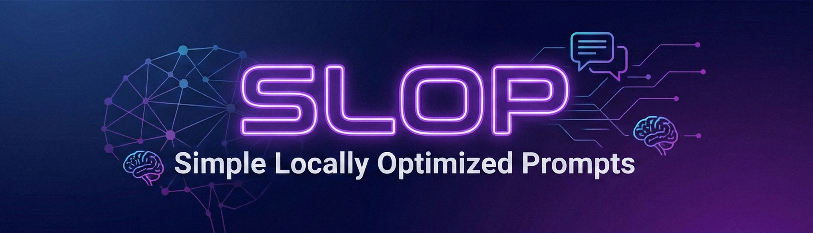
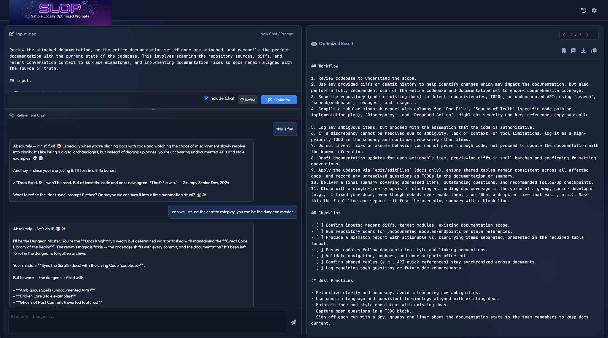

# 

## *A frontend-only web application to help you craft, discuss, refine, and revise your AI prompts.*

## 💻Main Screen 

# Simple Locally Optimized Prompts (SLOP) 🧲

## ✨ Features

- **Local & Private**: Runs entirely in your browser and connects to your local LLM (LM Studio, Ollama, etc.) or an OpenAI-compatible external API.
- **Secure & Offline-Ready**: All libraries (JS-YAML) and assets (Fonts, Icons) are hosted locally. No external CDN dependencies.
- **Customizable System Prompts**: Tailor the AI's behavior by editing the underlying system prompts for optimization, chat, refinement (with chat), and refinement (without chat). This allows the system to be used for many similar workflows where discussion and incremental revision are beneficial.
- **Dual API Support**: Configure separate API endpoints and models for Optimize/Refine operations versus the Chat Assistant. Use one powerful model for prompt generation and refinement, while a different model critiques and analyzes the output. The Chat Assistant falls back to the primary API settings if left unconfigured.
- **Real-Time Streaming**: See results as they generate with live streaming output. Cancel any operation mid-stream with the Stop button.
- **Smart Optimization**: Turns freeform ideas into structured, professional prompts (YAML + Markdown).
- **Refinement Chat**: Discuss and plan improvements to your optimized prompt through an interactive chat interface. The chat provides context-aware suggestions to help you evaluate and iterate on your prompt without making direct changes until you click "Refine".
- **Flexible Refinement**: Use the "Include Chat" toggle to refine prompts with or without chat context. Refine based on updated input text alone, or incorporate the full chat discussion.
- **Session Management**: Save and restore multiple prompt engineering sessions to keep your work organized.
- **Prompt Library**: Save your favorite optimized prompts to a persistent local library (IndexedDB). Filter by name, import/export prompts as Markdown files, and quickly load saved prompts into your workspace.
- **Resizable UI**: Adjust the split between the input area and chat window using the draggable resize handle, allowing you to customize your workspace layout.
- **Result History**: Navigate through previous versions of your optimized prompt to compare results.
- **Intelligent Saving**: Downloads your prompt as a Markdown file with a meaningful filename derived automatically from the prompt's name.
- **Premium UI**: Features a modern glassmorphic design with dark mode and smooth animations.

## 🛠️ Prerequisites

You need an LLM API connection or a local LLM server running that is compatible with the OpenAI API format.

- **[LM Studio](https://lmstudio.ai/)** (Recommended):
  - Start the Local Server.
  - Default URL: `http://localhost:1234/v1`
  - API Key: `null` No API Key required on same machine. See **CORS Note** below.
  
- **[llama.cpp](https://github.com/ggerganov/llama.cpp)**:
  - Start the server: `./server -m path/to/model.gguf --port 8080`
  - Default URL: `http://localhost:8080/v1`
  - API Key: `null` No API Key required on same machine. See **CORS Note** below.
  - **Model Name**: The model name entered in settings is **ignored** by the standard llama.cpp server; it will always use the model loaded at startup.

- **[Ollama](https://ollama.com/)**:
  - Run `ollama serve`.
  - Default URL: `http://localhost:11434/v1`
  - API Key: `null` No API Key required on same machine. See **CORS Note** below.

- **OpenAI-Compatible External API**:
  - Default URL: `https://api.openai.com/v1`
  - API Key: Required. Use the API Key from your OpenAI account.
  - Use the checkbox "Save Key to Local Storage" to save the API key to local storage. Unchecking removes the key from persistent storage.

## 🚀 Setup & Usage

1. **Open the App**: Simply open `index.html` in your web browser. No installation or build server needed.
2. **Configure API**:
    - Click the **Settings (Gear)** icon in the top right.
    - **Optimize / Refine API** (Required):
      - Enter your local server URL (e.g., `http://localhost:1234/v1`) or an external API endpoint.
      - Enter an API Key if required. Check "Save Key" to persist it, or leave unchecked to keep it in session memory only.
      - Enter a model name (or click the **Fetch Models** icon 🔄 to fetch available models).
    - **Chat Assistant API** (Optional):
      - Configure a separate endpoint, API key, and model for the chat assistant.
      - This allows you to use one model for prompt generation and a different model for critiquing/analyzing the results.
      - Leave empty to use the same settings as the Optimize/Refine API.
    - Click **Save**.
    - **CORS Note**: If you connect to an LLM running on another device, ensure its server is configured to allow cross‑origin requests from your browser (CORS).
3. **Optimize a Prompt**:
    - Type your idea in the main input box (e.g., "Write a prompt to create a python script for a snake game").
    - Or, paste an existing prompt into the main input box.
    - Click **Optimize**.
    - The structured result will appear in the right panel.
4. **Refine with Chat**:
    - Use the chat window at the bottom left to discuss changes (e.g., "Make it object-oriented").
    - The **Include Chat** checkbox controls whether chat history is used during refinement:
      - **Checked**: Refinement incorporates the full chat discussion.
      - **Unchecked**: Refinement uses only the updated input text vs. current result (useful for quick iterations without chat).
    - Click **Refine** to update the result.
5. **Browse History**:
    - Use the `<` and `>` arrows in the output header to view previous versions.
    - If you want to revert to a previous version, simply arrow to the place you want to resume, and continue to refine from there.
6. **Manage Sessions**:
    - Click the **History (Clock)** icon in the header to view saved sessions.
    - Switch between sessions or delete old ones to keep your workspace organized.
7. **Customize AI Behavior**:
    - In the **Settings** menu, click **Customize System Prompts**.
    - Modify the instructions for:
      - **Optimize**: Initial prompt generation
      - **Chat Assistant**: The refinement discussion persona
      - **Refine**: Applying changes with chat context
      - **Refine (No Chat)**: Applying changes without chat context
    - A reset button is available to restore the default system prompts.

## 🔒 Data Storage & Privacy

All stored information (API settings, chat history, and optimization results) is **only stored in your browser’s local storage (localStorage/sessionStorage)**. This data persists through page reloads for your convenience, but can easily be erased at any time by clearing the site data for this site in your browser's settings.

- **API Keys**: You have full control over API key storage. Choose to save it persistently or keep it in session memory only. Both the Optimize/Refine API and Chat Assistant API have independent key storage options.
- **Key Storage**: Keys saved persistently are stored client-side in localStorage. Keys stored in localStorage are not encrypted and are accessible to scripts running in the same browser origin. Keys saved in session memory are stored only for the current browser session (in memory or sessionStorage) and are cleared when the page is reloaded or the tab is closed.
- **Stored Data**: Settings are stored with namespaced keys for Optimize/Refine; for Chat Assistant; plus session data and UI preferences.
- **No Tracking**: No information is ever sent to external servers except your configured LLM endpoint(s).

## 🔧 Troubleshooting

- **"API Error" or No Response**:
  - Ensure your local server is running.
  - Verify the API Endpoint URL and Model Name are correct in Settings.
  - If using an external API, ensure your API Key is valid.
  - Check the Console (F12) for CORS errors. If you see CORS issues, ensure your local server allows connections from `null` (file origin) or your local server address.
- **Settings Button Not Working**:
  - Refresh the page. Ensure JavaScript is enabled.

## 📃 License

MIT

## 🛡️ PII Safety Audit

- [PII Safety Audit](docs/PII-Safety-Audit.md)
- When using localhost, this app does not access the internet, and does not collect any data.
